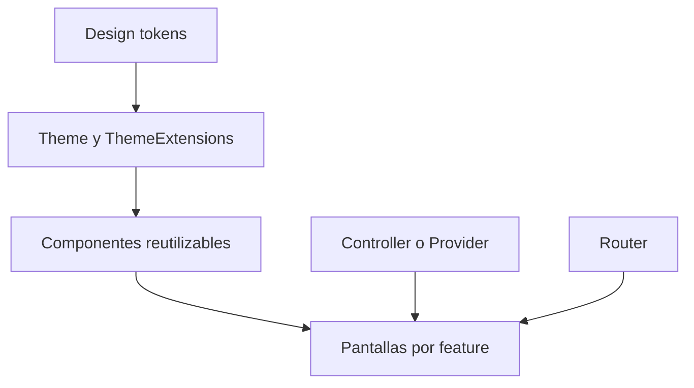
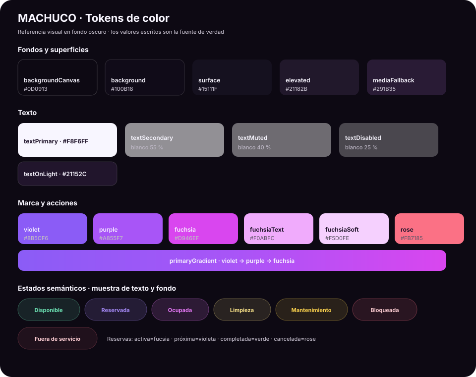
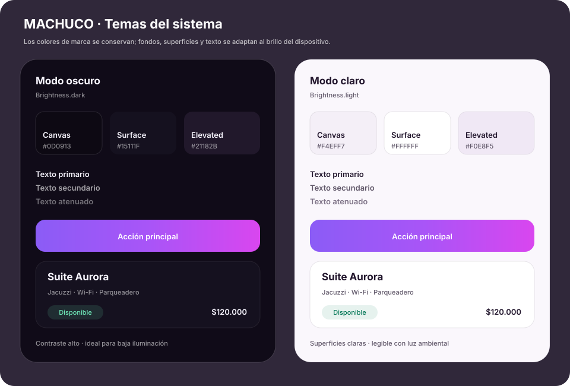
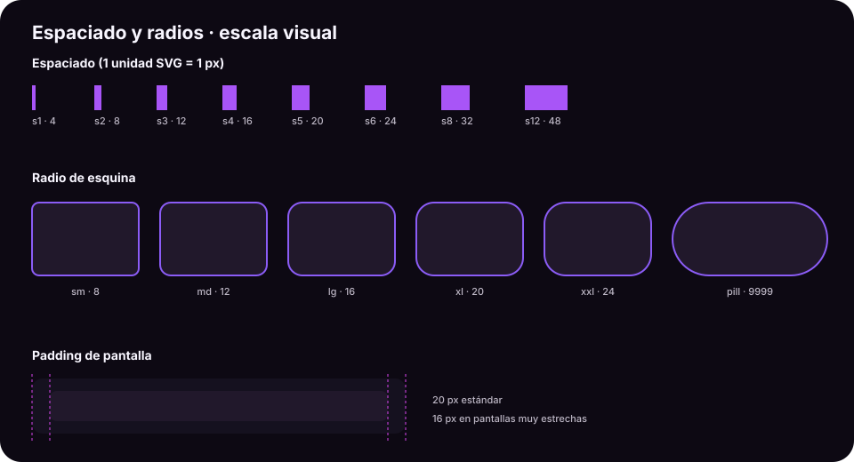
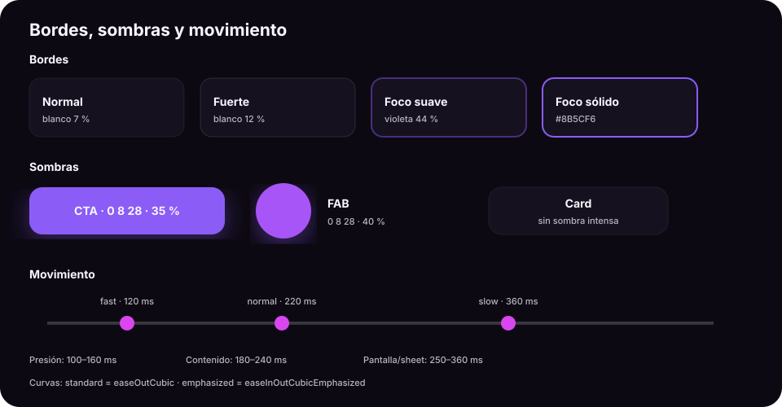
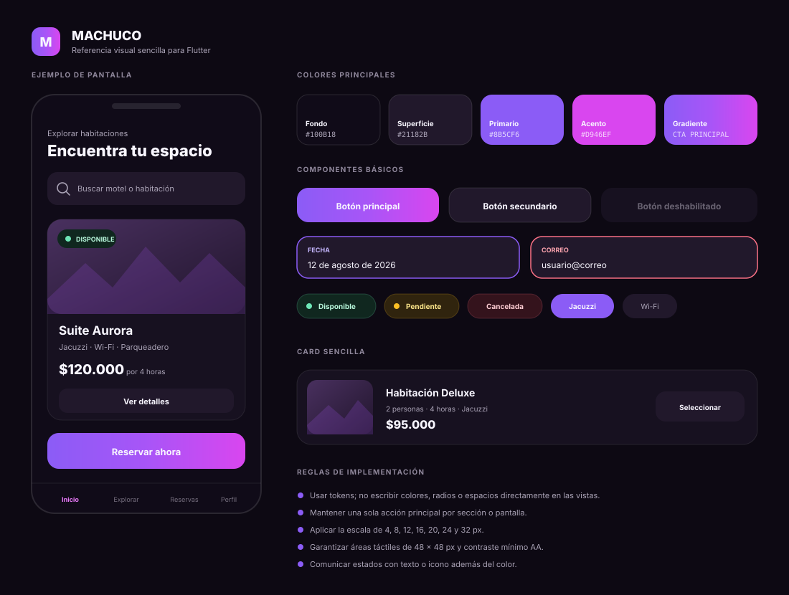

# Guía de diseño e implementación visual — Flutter

Especificación exclusiva de la experiencia visual de MACHUCO: identidad, tokens, tema, componentes, navegación de interfaz, adaptabilidad, accesibilidad, movimiento y validación visual.

El contexto del producto está en [README.md](README.md) y las prácticas generales de ingeniería, seguridad, pruebas y colaboración están en [GUIA_MACHUCO.md](GUIA_MACHUCO.md).

> Aplicación móvil para Android e iOS · Sistema visual MACHUCO · Temas claro y oscuro

## Índice

1. [Propósito](#1-propósito)
2. [Principios de diseño](#2-principios-de-diseño)
3. [Tecnología y librerías recomendadas](#3-tecnología-y-librerías-recomendadas)
4. [Arquitectura visual propuesta](#4-arquitectura-visual-propuesta)
5. [Design tokens](#5-design-tokens)
6. [Tema global](#6-tema-global)
7. [Tipografía](#7-tipografía)
8. [Iconografía](#8-iconografía)
9. [Componentes reutilizables](#9-componentes-reutilizables)
10. [Animaciones y transiciones](#10-animaciones-y-transiciones)
11. [Navegación](#11-navegación)
12. [Diseño adaptable para Android e iOS](#12-diseño-adaptable-para-android-e-ios)
13. [Accesibilidad](#13-accesibilidad)
14. [Imágenes, carga y estados de interfaz](#14-imágenes-carga-y-estados-de-interfaz)
15. [Convenciones de desarrollo](#15-convenciones-de-desarrollo)
16. [Pruebas y control de calidad visual](#16-pruebas-y-control-de-calidad-visual)
17. [Plan de implementación](#17-plan-de-implementación)
18. [Criterios de aceptación](#18-criterios-de-aceptación)
19. [Previsualización integral](#19-previsualización-integral)

---

## 1. Propósito

Este documento define cómo diseñar, construir y mantener la interfaz de una aplicación Flutter para Android e iOS. Su objetivo es que todas las pantallas compartan:

- Una identidad visual coherente.
- Componentes predecibles y reutilizables.
- Una experiencia fluida en distintos tamaños de pantalla.
- Accesibilidad, legibilidad y áreas táctiles adecuadas.
- Separación clara entre diseño, estado, navegación y lógica de negocio.

El sistema incluye temas **claro y oscuro**. De forma predeterminada respeta el brillo configurado en el dispositivo mediante `ThemeMode.system`; las vistas nunca deben decidir colores según el brillo ni crear colores directamente.

---

## 2. Principios de diseño

1. **Consistencia antes que personalización local:** una pantalla consume tokens y componentes; no redefine estilos.
2. **Jerarquía clara:** una acción primaria por sección y máximo una CTA dominante por pantalla.
3. **Diseño sobrio:** los gradientes identifican acciones principales, no decoran todas las superficies.
4. **Contenido primero:** las animaciones explican cambios de estado; nunca retrasan una tarea.
5. **Adaptable al espacio y al brillo:** se diseña por espacio disponible y tokens semánticos, no para un teléfono o tema concreto.
6. **Accesible por defecto:** contraste, escalado de texto, etiquetas semánticas y objetivos táctiles mínimos.
7. **Rendimiento visible:** imágenes optimizadas, listas perezosas y reconstrucciones limitadas.

### Reglas de marca

- Usar el gradiente violeta → púrpura → fucsia únicamente en CTA principal, FAB, onboarding y acentos excepcionales.
- No usar gradientes en cards de contenido.
- Reservar `Rose` para errores, cancelación o acciones destructivas.
- No comunicar estados solo mediante color: acompañarlos con texto e icono cuando sea necesario.
- Aplicar glassmorphism únicamente a controles flotantes sobre imágenes.

---

## 3. Tecnología y librerías recomendadas

La base debe ser **Material 3**, porque Flutter lo integra de forma nativa, permite tematizar todos los componentes y mantiene un comportamiento consistente en Android e iOS. La identidad de la aplicación se construye encima mediante `ColorScheme`, tokens y widgets propios.

### Dependencias principales

| Necesidad | Recomendación | Justificación |
|---|---|---|
| Sistema base de widgets | Flutter Material 3 | Nativo, accesible, estable y altamente tematizable. Evita depender de un kit visual completo externo. |
| Navegación | `go_router` | Rutas declarativas, redirecciones, deep links, shells y navegación inferior. |
| Estado de presentación | `flutter_riverpod` | Separa estado de UI, representa carga/error/datos y facilita pruebas. Si el proyecto ya adoptó otra solución, no migrar solo por diseño. |
| Fuente | Inter incluida en `assets/fonts/` | Resultado reproducible y disponible sin red. `google_fonts` puede utilizarse durante prototipado. |
| SVG | `flutter_svg` | Logos e iconos de marca escalables sin pérdida. |
| Imágenes remotas | `cached_network_image` | Caché, placeholder y fallback de error para fotos de moteles y habitaciones. |
| Microanimaciones | `flutter_animate` | API compacta para fade, slide, scale y secuencias sencillas. |
| Transiciones Material | `animations` | Patrones como shared axis, fade-through y container transform. Usar solo cuando aporten continuidad. |
| Animación ilustrada | `lottie` (opcional) | Solo para onboarding, confirmaciones o estados vacíos creados como archivos Lottie. |
| Formatos locales | `intl` | Fechas, horas, moneda y separadores según la configuración regional. |
| Skeletons | `skeletonizer` (opcional) | Estados de carga con la misma geometría del contenido. No combinarlo con otro paquete de shimmer. |

### Iconos

Usar primero `Icons` de Material para acciones comunes. Agregar `material_symbols_icons` solo si el diseño requiere variantes Rounded consistentes que no estén cubiertas por Flutter. Los iconos exclusivos de marca deben ser SVG locales.

### Instalación orientativa

No se fijan versiones en este documento: deben resolverse versiones compatibles con el SDK definido en `pubspec.yaml` y conservarse en `pubspec.lock`.

```bash
flutter pub add go_router flutter_riverpod flutter_svg cached_network_image flutter_animate animations intl
flutter pub add --dev flutter_lints
```

Opcionales:

```bash
flutter pub add lottie skeletonizer material_symbols_icons
```

### Qué no se recomienda

- Instalar un kit de UI completo para sustituir Material 3: dificulta mantener la identidad propia.
- Mezclar dos soluciones para navegación, estado, iconos o skeletons.
- Usar paquetes para efectos que Flutter ya resuelve con `AnimatedContainer`, `AnimatedSwitcher`, `Hero` o `TweenAnimationBuilder`.
- Copiar números hexadecimales, radios o duraciones directamente en las pantallas.

---

## 4. Arquitectura visual propuesta

La estructura actual puede evolucionar sin eliminar sus carpetas funcionales. Se agrega `core/design_system` para los elementos globales y se organiza la presentación por funcionalidad.

```text
lib/
├── core/
│   ├── design_system/
│   │   ├── tokens/
│   │   │   ├── app_colors.dart
│   │   │   ├── app_gradients.dart
│   │   │   ├── app_radius.dart
│   │   │   ├── app_shadows.dart
│   │   │   ├── app_spacing.dart
│   │   │   ├── app_text_styles.dart
│   │   │   └── app_motion.dart
│   │   ├── theme/
│   │   │   ├── app_color_scheme.dart
│   │   │   ├── app_theme.dart
│   │   │   └── app_theme_extensions.dart
│   │   ├── components/
│   │   │   ├── buttons/
│   │   │   ├── cards/
│   │   │   ├── feedback/
│   │   │   ├── forms/
│   │   │   ├── navigation/
│   │   │   └── status/
│   │   └── design_system.dart
│   └── extensions/
├── widgets/                  # Widgets compartidos existentes; migrar gradualmente
├── views/                    # Pantallas existentes; no contener estilos globales
├── models/
├── controllers/              # Estado/orquestación; nunca colores o widgets
├── routes/
│   ├── app_router.dart
│   ├── route_names.dart
│   └── transitions.dart
├── service/
├── data/
├── repository/
├── utils/                    # Utilidades puras, no design tokens
├── features/                 # Recomendado para crecimiento progresivo
│   ├── auth/presentation/
│   ├── motels/presentation/
│   ├── rooms/presentation/
│   └── reservations/presentation/
└── main.dart
```

### Responsabilidad de cada capa visual

| Capa | Responsabilidad | No debe contener |
|---|---|---|
| Tokens | Valores atómicos: color, espacio, radio, duración | Widgets o reglas de negocio |
| Theme | Configuración global de componentes Material | Datos de pantallas |
| Components | Elementos visuales reutilizables y sus variantes | Acceso directo a repositorios |
| Views/Presentation | Composición de pantallas y conexión al estado | Hexadecimales o estilos duplicados |
| Controllers/Providers | Estado de presentación y acciones | Construcción de widgets |
| Routes | Navegación, guards y transiciones | Lógica de negocio |

### Flujo recomendado



La interfaz recibe modelos de presentación ya preparados. Una card no debe consultar servicios ni decidir reglas de disponibilidad.

---

## 5. Design tokens

### 5.1 Paleta de colores

#### Previsualización



> Las muestras permiten comparar jerarquía y contraste. Los valores escritos en las tablas siguen siendo la fuente de verdad para la implementación.

#### Comparación de temas



Los colores de marca mantienen la identidad en ambos modos. Los tokens semánticos cambian para preservar contraste y legibilidad:

| Token semántico | Modo oscuro | Modo claro | Uso |
|---|---:|---:|---|
| `canvas` | <span style="display:inline-block;width:1em;height:1em;background:#0D0913;border:1px solid #888"></span> `#0D0913` | <span style="display:inline-block;width:1em;height:1em;background:#F4EFF7;border:1px solid #888"></span> `#F4EFF7` | Exterior y navegación |
| `background` | <span style="display:inline-block;width:1em;height:1em;background:#100B18;border:1px solid #888"></span> `#100B18` | <span style="display:inline-block;width:1em;height:1em;background:#FAF7FC;border:1px solid #888"></span> `#FAF7FC` | Fondo de pantalla |
| `surface` | <span style="display:inline-block;width:1em;height:1em;background:#15111F;border:1px solid #888"></span> `#15111F` | <span style="display:inline-block;width:1em;height:1em;background:#FFFFFF;border:1px solid #888"></span> `#FFFFFF` | Cards y superficies |
| `elevated` | <span style="display:inline-block;width:1em;height:1em;background:#21182B;border:1px solid #888"></span> `#21182B` | <span style="display:inline-block;width:1em;height:1em;background:#F0E8F5;border:1px solid #888"></span> `#F0E8F5` | Inputs, sheets y modales |
| `textPrimary` | <span style="display:inline-block;width:1em;height:1em;background:#F8F6FF;border:1px solid #888"></span> `#F8F6FF` | <span style="display:inline-block;width:1em;height:1em;background:#21152C;border:1px solid #888"></span> `#21152C` | Información principal |
| `textSecondary` | <span style="display:inline-block;width:1em;height:1em;background:rgba(255,255,255,.55);border:1px solid #888"></span> `#FFFFFF` al 55 % | <span style="display:inline-block;width:1em;height:1em;background:#5F5668;border:1px solid #888"></span> `#5F5668` | Descripciones |
| `textMuted` | <span style="display:inline-block;width:1em;height:1em;background:rgba(255,255,255,.40);border:1px solid #888"></span> `#FFFFFF` al 40 % | <span style="display:inline-block;width:1em;height:1em;background:#7D7286;border:1px solid #888"></span> `#7D7286` | Metadata |
| `border` | <span style="display:inline-block;width:1em;height:1em;background:rgba(255,255,255,.07);border:1px solid #888"></span> `#FFFFFF` al 7 % | <span style="display:inline-block;width:1em;height:1em;background:rgba(33,21,44,.10);border:1px solid #888"></span> `#21152C` al 10 % | Separadores y cards |

> GitHub puede omitir estilos HTML en algunos contextos. Los SVG anteriores son la referencia visual estable y los hexadecimales son la especificación exacta.

#### Fondos y superficies

| Token Dart | Hex | Uso |
|---|---:|---|
| `backgroundCanvas` | <span style="display:inline-block;width:1em;height:1em;background:#0D0913;border:1px solid #888"></span> `#0D0913` | Exterior, navegación inferior |
| `background` | <span style="display:inline-block;width:1em;height:1em;background:#100B18;border:1px solid #888"></span> `#100B18` | Fondo principal de pantalla |
| `surface` | <span style="display:inline-block;width:1em;height:1em;background:#15111F;border:1px solid #888"></span> `#15111F` | Cards y superficies base |
| `elevated` | <span style="display:inline-block;width:1em;height:1em;background:#21182B;border:1px solid #888"></span> `#21182B` | Inputs, chips, modales y sheets |
| `mediaFallback` | <span style="display:inline-block;width:1em;height:1em;background:#291B35;border:1px solid #888"></span> `#291B35` | Respaldo mientras carga una imagen |

#### Texto

| Token Dart | Valor | Uso |
|---|---:|---|
| `textPrimary` | <span style="display:inline-block;width:1em;height:1em;background:#F8F6FF;border:1px solid #888"></span> `#F8F6FF` | Títulos y datos críticos |
| `textSecondary` | <span style="display:inline-block;width:1em;height:1em;background:rgba(255,255,255,.55);border:1px solid #888"></span> `#FFFFFF` al 55 % | Descripciones |
| `textMuted` | <span style="display:inline-block;width:1em;height:1em;background:rgba(255,255,255,.40);border:1px solid #888"></span> `#FFFFFF` al 40 % | Metadatos y labels |
| `textDisabled` | <span style="display:inline-block;width:1em;height:1em;background:rgba(255,255,255,.25);border:1px solid #888"></span> `#FFFFFF` al 25 % | Controles deshabilitados |
| `textOnLight` | <span style="display:inline-block;width:1em;height:1em;background:#21152C;border:1px solid #888"></span> `#21152C` | Texto sobre fondos claros |

#### Marca y acciones

| Token Dart | Hex | Uso |
|---|---:|---|
| `violet` | <span style="display:inline-block;width:1em;height:1em;background:#8B5CF6;border:1px solid #888"></span> `#8B5CF6` | Primario, foco y selección |
| `purple` | <span style="display:inline-block;width:1em;height:1em;background:#A855F7;border:1px solid #888"></span> `#A855F7` | Centro del gradiente y secundario |
| `fuchsia` | <span style="display:inline-block;width:1em;height:1em;background:#D946EF;border:1px solid #888"></span> `#D946EF` | Final del gradiente y acento |
| `fuchsiaText` | <span style="display:inline-block;width:1em;height:1em;background:#F0ABFC;border:1px solid #888"></span> `#F0ABFC` | Texto/acento legible sobre oscuro |
| `fuchsiaSoft` | <span style="display:inline-block;width:1em;height:1em;background:#F5D0FE;border:1px solid #888"></span> `#F5D0FE` | Highlights pequeños |
| `rose` | <span style="display:inline-block;width:1em;height:1em;background:#FB7185;border:1px solid #888"></span> `#FB7185` | Error, cancelar y eliminar |

#### Estados semánticos

| Estado | Texto | Fondo | Etiqueta |
|---|---:|---:|---|
| Disponible | <span style="display:inline-block;width:1em;height:1em;background:#6EE7B7;border:1px solid #888"></span> `#6EE7B7` | <span style="display:inline-block;width:1em;height:1em;background:rgba(110,231,183,.12);border:1px solid #888"></span> verde al 12 % | Disponible |
| Reservada | <span style="display:inline-block;width:1em;height:1em;background:#A78BFA;border:1px solid #888"></span> `#A78BFA` | <span style="display:inline-block;width:1em;height:1em;background:rgba(167,139,250,.15);border:1px solid #888"></span> violeta al 15 % | Reservada |
| Ocupada | <span style="display:inline-block;width:1em;height:1em;background:#E879F9;border:1px solid #888"></span> `#E879F9` | <span style="display:inline-block;width:1em;height:1em;background:rgba(232,121,249,.15);border:1px solid #888"></span> fucsia al 15 % | Ocupada |
| Limpieza | <span style="display:inline-block;width:1em;height:1em;background:#FDE68A;border:1px solid #888"></span> `#FDE68A` | <span style="display:inline-block;width:1em;height:1em;background:rgba(253,230,138,.12);border:1px solid #888"></span> amarillo al 12 % | Limpieza |
| Mantenimiento | <span style="display:inline-block;width:1em;height:1em;background:#FCD34D;border:1px solid #888"></span> `#FCD34D` | <span style="display:inline-block;width:1em;height:1em;background:rgba(252,211,77,.12);border:1px solid #888"></span> amarillo al 12 % | Mantenimiento |
| Bloqueada | <span style="display:inline-block;width:1em;height:1em;background:#FECDD3;border:1px solid #888"></span> `#FECDD3` | <span style="display:inline-block;width:1em;height:1em;background:rgba(254,205,211,.12);border:1px solid #888"></span> rose al 12 % | Bloqueada |
| Fuera de servicio | <span style="display:inline-block;width:1em;height:1em;background:#FECDD3;border:1px solid #888"></span> `#FECDD3` | <span style="display:inline-block;width:1em;height:1em;background:rgba(254,205,211,.08);border:1px solid #888"></span> rose al 8 % | Fuera de servicio |

Los estados de reserva deben reutilizar la misma semántica: activa (fucsia), próxima (violeta), completada (verde) y cancelada (rose).

### 5.2 Espaciado y radios



La longitud de cada barra y la curvatura de cada rectángulo representan el valor real del token en píxeles lógicos.

Escala base: 4 px.

| Espacio | Valor | Radio | Valor |
|---|---:|---|---:|
| `s1` | 4 | `sm` | 8 |
| `s2` | 8 | `md` | 12 |
| `s3` | 12 | `lg` | 16 |
| `s4` | 16 | `xl` | 20 |
| `s5` | 20 | `xxl` | 24 |
| `s6` | 24 | `pill` | 9999 |
| `s8` | 32 | | |
| `s12` | 48 | | |

El padding horizontal estándar de pantalla es 20 px. En pantallas muy estrechas puede reducirse a 16 px; en tablet, el contenido debe limitar su ancho en lugar de estirarse indefinidamente.

### 5.3 Bordes y sombras



La primera mitad de la lámina compara opacidades de borde y elevaciones. La segunda mitad representa los tokens de movimiento definidos en la sección siguiente.

- Borde normal: blanco al 7 %.
- Borde fuerte: blanco al 12 %.
- Borde de foco: violeta al 44 % o violeta sólido cuando se requiera mayor contraste.
- Cards: elevación visual por superficie y borde, no por sombras intensas.
- CTA: sombra violeta suave `0 8 28` con 35 % de opacidad.
- FAB: sombra violeta suave `0 8 28` con 40 % de opacidad.

### 5.4 Movimiento

La línea temporal de la previsualización anterior sitúa `fast`, `normal` y `slow` en una misma escala, además de indicar los rangos recomendados por interacción.

```dart
abstract final class AppMotion {
  static const fast = Duration(milliseconds: 120);
  static const normal = Duration(milliseconds: 220);
  static const slow = Duration(milliseconds: 360);

  static const standard = Curves.easeOutCubic;
  static const emphasized = Curves.easeInOutCubicEmphasized;
}
```

- Presión y selección: 100–160 ms.
- Aparición de contenido: 180–240 ms.
- Cambio de pantalla o sheet: 250–360 ms.
- Nunca usar animaciones decorativas repetitivas en tareas críticas.

---

## 6. Tema global

`ThemeData` es la fuente principal de verdad. Debe configurar al menos `ColorScheme`, texto, botones, campos, cards, chips, navegación, dialogs, sheets, snackbars y date/time pickers.

Los valores dependientes del brillo se separan de los colores de marca:

```dart
abstract final class AppLightColors {
  static const canvas = Color(0xFFF4EFF7);
  static const background = Color(0xFFFAF7FC);
  static const surface = Color(0xFFFFFFFF);
  static const elevated = Color(0xFFF0E8F5);
  static const textPrimary = Color(0xFF21152C);
  static const textSecondary = Color(0xFF5F5668);
  static const textMuted = Color(0xFF7D7286);
}

abstract final class AppDarkColors {
  static const canvas = Color(0xFF0D0913);
  static const background = Color(0xFF100B18);
  static const surface = Color(0xFF15111F);
  static const elevated = Color(0xFF21182B);
  static const textPrimary = Color(0xFFF8F6FF);
  static const textSecondary = Color.fromRGBO(255, 255, 255, 0.55);
  static const textMuted = Color.fromRGBO(255, 255, 255, 0.40);
}
```

Las vistas deben preferir `Theme.of(context).colorScheme` y extensiones semánticas. No deben preguntar `MediaQuery.platformBrightnessOf(context)` para elegir colores manualmente.

```dart
final class AppTheme {
  const AppTheme._();

  static ThemeData get light => _build(
        brightness: Brightness.light,
        background: AppLightColors.background,
        surface: AppLightColors.surface,
        elevated: AppLightColors.elevated,
        onSurface: AppLightColors.textPrimary,
      );

  static ThemeData get dark => _build(
        brightness: Brightness.dark,
        background: AppDarkColors.background,
        surface: AppDarkColors.surface,
        elevated: AppDarkColors.elevated,
        onSurface: AppDarkColors.textPrimary,
      );

  static ThemeData _build({
    required Brightness brightness,
    required Color background,
    required Color surface,
    required Color elevated,
    required Color onSurface,
  }) {
    final scheme = ColorScheme.fromSeed(
      seedColor: AppColors.violet,
      brightness: brightness,
    ).copyWith(
      primary: AppColors.violet,
      onPrimary: Colors.white,
      secondary: AppColors.purple,
      onSecondary: Colors.white,
      tertiary: AppColors.fuchsia,
      onTertiary: Colors.white,
      surface: surface,
      onSurface: onSurface,
      error: AppColors.rose,
      onError: Colors.white,
    );

    return ThemeData(
      useMaterial3: true,
      brightness: brightness,
      colorScheme: scheme,
      scaffoldBackgroundColor: background,
      fontFamily: 'Inter',
      visualDensity: VisualDensity.standard,
      splashFactory: InkSparkle.splashFactory,
      cardTheme: CardThemeData(
        color: surface,
        elevation: 0,
        margin: EdgeInsets.zero,
        shape: RoundedRectangleBorder(
          borderRadius: BorderRadius.circular(AppRadius.lg),
          side: BorderSide(color: onSurface.withValues(alpha: 0.10)),
        ),
      ),
      inputDecorationTheme: InputDecorationTheme(
        filled: true,
        fillColor: elevated,
        contentPadding: const EdgeInsets.symmetric(horizontal: 14, vertical: 12),
        hintStyle: TextStyle(color: onSurface.withValues(alpha: 0.45)),
        border: _inputBorder(Colors.transparent),
        enabledBorder: _inputBorder(Colors.transparent),
        focusedBorder: _inputBorder(AppColors.violet),
        errorBorder: _inputBorder(AppColors.rose),
        focusedErrorBorder: _inputBorder(AppColors.rose),
      ),
      bottomSheetTheme: BottomSheetThemeData(
        backgroundColor: elevated,
        modalBackgroundColor: elevated,
        showDragHandle: true,
      ),
    );
  }

  static OutlineInputBorder _inputBorder(Color color) => OutlineInputBorder(
        borderRadius: BorderRadius.circular(AppRadius.md),
        borderSide: BorderSide(color: color),
      );
}
```

> Nota: según la versión de Flutter, algunos tipos de tema pueden cambiar de `CardTheme` a `CardThemeData`. Ajustar al SDK del proyecto y validar con `flutter analyze`.

En `main.dart`:

```dart
void main() {
  WidgetsFlutterBinding.ensureInitialized();
  runApp(const ProviderScope(child: App()));
}

class App extends StatelessWidget {
  const App({super.key});

  @override
  Widget build(BuildContext context) {
    return MaterialApp.router(
      debugShowCheckedModeBanner: false,
      title: 'MACHUCO',
      theme: AppTheme.light,
      darkTheme: AppTheme.dark,
      themeMode: ThemeMode.system,
      routerConfig: appRouter,
    );
  }
}
```

---

## 7. Tipografía

Fuente: **Inter**. Para producción se recomienda incluir solo los pesos usados en `assets/fonts/` y declararlos en `pubspec.yaml`; esto evita depender de una descarga en tiempo de ejecución.

| Rol | Tamaño | Peso | Altura | Uso |
|---|---:|---:|---:|---|
| Display | 28–32 | 800 | 1.2 | Bienvenida o hero |
| H1 | 24 | 700 | 1.3 | Título de pantalla |
| H2 | 20 | 700 | 1.4 | Título de detalle |
| H3 | 18 | 600 | 1.5 | Sección |
| Body large | 15 | 500 | 1.6 | Botones y texto destacado |
| Body | 14 | 400 | 1.5 | Cuerpo e inputs |
| Body small | 13 | 400 | 1.5 | Descripciones |
| Caption | 12 | 500 | 1.4 | Badges y metadata |
| Micro | 10 | 600 | 1.4 | Labels cortos en mayúscula |

Convenciones:

- No usar tamaños menores de 12 px para información necesaria. `Micro` y `Nano` quedan limitados a detalles auxiliares.
- No fijar la altura de un contenedor que tenga texto variable.
- Probar el diseño con escalado de texto de al menos 200 %.
- Evitar mayúsculas en frases extensas.
- Los precios deben usar formato local, por ejemplo `NumberFormat.currency(locale: 'es_CO', symbol: r'$')`.

---

## 8. Iconografía

- Tamaño estándar: 20–24 px.
- Iconos compactos en badges: 14–18 px.
- Área táctil del botón que contiene el icono: mínimo 48 × 48 px.
- Grosor visual consistente; no mezclar Filled, Outlined y Rounded sin una regla.
- Todo icono sin texto debe incluir `tooltip` y una etiqueta semántica comprensible.
- No usar emojis como iconos funcionales.

---

## 9. Componentes reutilizables

Cada componente público debe exponer una API pequeña: contenido, variante, estado, acción y, cuando aplique, tamaño. No debe recibir colores arbitrarios si existe una variante semántica.

### Catálogo mínimo

| Componente | Variantes/estados |
|---|---|
| `AppButton` | primary, secondary, destructive, loading, disabled |
| `AppIconButton` | standard, overlay, destructive |
| `AppTextField` | normal, focused, error, disabled |
| `AppSearchField` | vacío, con texto, loading |
| `AppCard` | standard, interactive, selected |
| `RoomCard` | disponibilidad, imagen, precio, servicios |
| `MotelCard` | rating, disponibilidad, precio desde |
| `StatusBadge` | habitación y reserva; sm/xs |
| `FilterChipGroup` | simple o selección múltiple |
| `AppBottomSheet` | scrollable, fixed action |
| `AppDialog` | información, confirmación, destructivo |
| `AppNavigationBar` | cliente y propietario |
| `AppEmptyState` | icono, título, explicación y acción opcional |
| `AppErrorState` | mensaje seguro, reintentar y código opcional |
| `AppSkeleton` | listas, cards y detalle |

### Botón primario

- Alto mínimo: 52 px.
- Radio: 16 px.
- Fondo: gradiente principal.
- Texto: 14–15 px, peso 700, blanco.
- Press: escala 0.97 durante 120 ms.
- Loading: conservar el ancho; bloquear pulsaciones y mostrar indicador.
- Disabled: superficie elevada y texto deshabilitado, sin sombra.

Para conservar ripple sobre gradiente, usar `Material` + `Ink` + `InkWell`. No implementar gestos con un `GestureDetector` si se pierde feedback, foco o semántica.

### Cards

- Radio: 16 px; borde blanco al 7 %; elevación 0.
- Una card interactiva completa usa `InkWell` y un único destino.
- No anidar varios botones ambiguos dentro del área táctil principal.
- Imagen de habitación: relación estable (recomendado 16:9) con `AspectRatio`, no altura rígida universal.
- Overlay inferior para texto sobre foto: transparente → `#100B18` al 92 %.

### Formularios

- Alto mínimo de campo: 48 px, pero debe crecer si el contenido o error ocupa más espacio.
- Label persistente; placeholder solo como ejemplo, no como nombre del campo.
- Teclado, capitalización y autofill según el dato.
- Validación junto al campo y resumen al enviar si existen varios errores.
- Selectores de fecha y hora deben usar componentes del sistema tematizados o una implementación accesible equivalente.

### Bottom sheets y diálogos

- Sheet con radio superior de 24 px, drag handle y padding inferior de `SafeArea`.
- Acciones persistentes fuera del contenido desplazable cuando el formulario sea largo.
- Diálogo destructivo: explicar qué se elimina o cancela; acción destructiva a la derecha y sin cierre accidental si existe pérdida importante.

### Navegación inferior

- Entre 3 y 5 destinos principales.
- Mostrar icono y etiqueta siempre.
- Ocultar en pantallas de detalle, formularios y flujos de reserva.
- Usar `NavigationBar` de Material 3 tematizada, con safe area. Si la marca exige ausencia de indicador, validar que el estado activo conserve contraste suficiente.

---

## 10. Animaciones y transiciones

### Regla de selección

1. Preferir animaciones implícitas nativas.
2. Usar `flutter_animate` para entrada/salida breve o secuencias pequeñas.
3. Usar `animations` para una transición que comunique relación entre dos pantallas.
4. Reservar Lottie para ilustraciones; no usarlo para controles esenciales.

### Patrones

| Situación | Transición | Duración |
|---|---|---:|
| Cambio de estado en el mismo espacio | `AnimatedSwitcher` con fade | 180–220 ms |
| Expandir detalles | `AnimatedSize` | 220 ms |
| Card → detalle | Container transform o `Hero` de imagen | 300–360 ms |
| Cambio entre destinos principales | Fade-through | 250–300 ms |
| Entrada de sheet | Desplazamiento vertical nativo | 300 ms |
| Presión de botón/card | Escala 0.97/0.98 | 100–140 ms |
| Confirmación | Escala + fade, una sola vez | 250–360 ms |

Respetar `MediaQuery.disableAnimations`. Si está activo, eliminar movimientos no esenciales y reducir transiciones a cambios instantáneos o fades breves.

No animar listas completas cada vez que el usuario vuelve a una pantalla. Evitar blur animado y sombras grandes en listas por su costo de renderizado.

---

## 11. Navegación

La especificación original basada en una variable `screen` y `history[]` no es apropiada para una aplicación Flutter escalable. Se recomienda `go_router` con:

- Rutas tipadas o nombres centralizados.
- `ShellRoute`/`StatefulShellRoute` para destinos raíz con navegación inferior.
- Rutas hijas para detalle y reserva sin barra inferior.
- Redirects para autenticación y rol de cliente/propietario.
- Deep links preparados para compartir motel, habitación o reserva.
- `PopScope` únicamente cuando haya cambios sin guardar o una operación que no deba interrumpirse.

Convención de rutas:

```text
/login
/client/home
/client/motels/:motelId
/client/motels/:motelId/rooms/:roomId
/client/reservations/new
/client/reservations/:reservationId
/owner/dashboard
/owner/rooms
/owner/reservations/:reservationId
```

No enviar modelos completos por la URL. Usar identificadores y obtener/leer el estado desde la capa correspondiente.

---

## 12. Diseño adaptable para Android e iOS

### Breakpoints orientativos

| Ancho disponible | Composición |
|---:|---|
| `< 360` | Compacta, padding 16, una columna |
| `360–599` | Móvil estándar, padding 20 |
| `600–839` | Móvil grande/tablet pequeña, grid de 2 columnas cuando aporte valor |
| `≥ 840` | Contenido centrado con ancho máximo y paneles múltiples opcionales |

Los breakpoints se calculan con `LayoutBuilder`, no con el nombre o la orientación del dispositivo.

### Reglas multiplataforma

- Aplicar `SafeArea` a navegación, sheets y contenido junto a notch/isla dinámica.
- No asumir altura fija de status bar o home indicator.
- Permitir gesto y botón de retroceso; conservar la convención de cada plataforma.
- Usar selectores adaptativos cuando el comportamiento nativo mejore la tarea; conservar colores, tipografía y espaciado de marca.
- Usar `SliverAppBar` solo si el colapso aporta espacio o contexto.
- En iOS validar scroll, teclado, swipe back y sheet; en Android validar botón/gesto back, ripple y edge-to-edge.
- Mantener contraste y jerarquía en pantallas OLED sin usar negro puro como fondo general.

---

## 13. Accesibilidad

La interfaz se considera incompleta si solo funciona visualmente.

- Contraste mínimo recomendado: 4.5:1 para texto normal y 3:1 para texto grande/componentes.
- Objetivo táctil mínimo: 48 × 48 logical pixels.
- Orden de foco coherente y navegación con teclado para pruebas y futuros dispositivos.
- `Semantics`, `Tooltip` y nombres de botón cuando el icono no tiene label visible.
- Anunciar carga, error y confirmación relevante sin producir mensajes repetitivos.
- No bloquear escalado de texto mediante `textScaler` fijo.
- Probar daltonismo: texto/icono además del color de estado.
- Haptic feedback ligero solo para confirmaciones, cambios relevantes y advertencias; nunca como único feedback.
- Respetar reducción de movimiento.

---

## 14. Imágenes, carga y estados de interfaz

### Imágenes

- Preferir AVIF/WebP cuando el backend y las plataformas objetivo lo permitan; conservar JPEG como alternativa cuando sea necesario.
- Solicitar imágenes cercanas al tamaño renderizado y no descargar originales innecesariamente.
- Mostrar `mediaFallback` y skeleton mientras carga.
- En error, mostrar fallback con icono, texto breve y reintento si aplica.
- Definir `fit`, relación de aspecto y alineación en cada componente para evitar saltos de layout.
- Incluir descripción semántica cuando la imagen aporte información.

### Estados obligatorios por pantalla de datos

1. **Inicial/carga:** skeleton con geometría realista.
2. **Contenido:** información actual y acciones habilitadas según permisos.
3. **Vacío:** explicar qué falta y cómo empezar.
4. **Error recuperable:** mensaje comprensible + reintentar.
5. **Sin conexión:** conservar datos en caché cuando sea posible e indicar antigüedad.
6. **Actualización:** mantener contenido anterior y mostrar progreso discreto.

No usar un spinner centrado para toda interacción. Las operaciones locales deben mostrar feedback en el control que las inició.

---

## 15. Convenciones de desarrollo

### Nombres y archivos

- Archivos y carpetas: `snake_case`.
- Clases, enums y extensiones: `UpperCamelCase`.
- Variables, funciones y parámetros: `lowerCamelCase`.
- Componentes del sistema: prefijo `App` (`AppButton`, `AppDialog`).
- Componentes de dominio: nombre explícito (`RoomCard`, `ReservationStatusBadge`).
- Tokens: nombres semánticos (`textPrimary`), no nombres circunstanciales (`whiteText`).

### Construcción de widgets

- Usar `const` siempre que sea posible.
- Dividir un widget cuando tenga una responsabilidad independiente, se reutilice o sea difícil de probar; no dividir cada `Row` en una clase.
- Evitar métodos extensos tipo `_buildSection()` para árboles complejos; preferir widgets privados con nombres claros.
- No realizar peticiones, formateos costosos ni mutaciones dentro de `build`.
- Usar `ListView.builder`/slivers para listas extensas.
- Conservar keys estables en listas y animaciones.
- Acceder al tema mediante `Theme.of(context)` o una `ThemeExtension`, no importando colores en cada pantalla cuando ya existen en el tema.

### Variantes sobre booleanos

Preferir enums:

```dart
enum AppButtonVariant { primary, secondary, destructive }
enum AppButtonSize { medium, large }
```

Evitar APIs como `isPrimary`, `isSecondary`, `isDanger`, que permiten combinaciones inválidas.

### Exportaciones

`design_system.dart` puede exportar la API pública estable. No exportar componentes internos ni crear barrels profundos por feature si producen dependencias circulares.

---

## 16. Pruebas y control de calidad visual

### Pruebas mínimas

- **Unitarias:** mapeo de estados a label/color y formateadores.
- **Widget tests:** variantes, loading/disabled, callbacks, errores y semántica.
- **Golden tests:** botones, campos, badges, cards, sheets y pantallas críticas.
- **Integración:** login, búsqueda, reserva, pago/confirmación, cancelación y administración.

### Matriz manual

Probar como mínimo:

- Un teléfono Android compacto y uno grande.
- Un iPhone compacto y uno con notch/isla dinámica.
- Escala de texto 100 %, 150 % y 200 %.
- Temas claro y oscuro del sistema, incluido el cambio de brillo con la aplicación abierta y sin parpadeos.
- Teclado abierto, rotación si está soportada y pérdida de conexión.
- Contenido extremo: nombres largos, precio grande, cero y muchas habitaciones.
- TalkBack y VoiceOver en los flujos principales.

### Comandos de validación

```bash
dart format .
flutter analyze
flutter test
flutter test --update-goldens  # solo tras aprobar cambios visuales intencionales
```

No actualizar goldens automáticamente en CI. Un cambio visual debe revisarse antes de aceptar la nueva referencia.

---

## 17. Plan de implementación

### Fase 1 — Fundamentos

1. Crear `core/design_system/tokens`.
2. Registrar Inter en assets.
3. Implementar `ColorScheme`, `ThemeData` y extensiones.
4. Configurar `MaterialApp.router` con `theme`, `darkTheme` y `ThemeMode.system`.
5. Añadir linting y una pantalla interna de catálogo de componentes.

### Fase 2 — Componentes base

1. Botones e icon buttons.
2. Inputs, search y selectores.
3. Cards, badges y chips.
4. Dialogs, sheets, snackbar y estados de feedback.
5. Navegación inferior y app bars.
6. Tests de widgets y goldens.

### Fase 3 — Migración de pantallas

1. Migrar primero un flujo vertical completo: listado → detalle → reserva → confirmación.
2. Reemplazar estilos locales por tokens/componentes.
3. Conectar loading/error/empty desde controllers/providers.
4. Verificar Android/iOS y accesibilidad.
5. Continuar por feature y eliminar widgets anteriores solo cuando no tengan consumidores.

### Fase 4 — Movimiento y optimización

1. Añadir microinteracciones después de estabilizar la navegación.
2. Medir jank y reconstrucciones en modo profile.
3. Optimizar imágenes y listas.
4. Documentar excepciones aprobadas en el catálogo.

---

## 18. Criterios de aceptación

La implementación visual se considera lista cuando:

- [ ] No existen colores hexadecimales ni estilos globales duplicados dentro de las vistas.
- [ ] Todas las pantallas usan los temas globales claro y oscuro sin colores locales dependientes del brillo.
- [ ] Los componentes esenciales tienen variantes loading, disabled y error cuando corresponda.
- [ ] Las áreas táctiles alcanzan 48 × 48 px.
- [ ] El texto funciona al 200 % sin perder acciones ni información esencial.
- [ ] Los estados no dependen únicamente del color.
- [ ] Navegación inferior, sheets y contenido respetan safe areas.
- [ ] Carga, vacío, error, sin conexión y reintento están definidos.
- [ ] Las imágenes tienen placeholder, fallback y relación de aspecto estable.
- [ ] Los flujos críticos pasan pruebas de widget/integración.
- [ ] Los componentes críticos cuentan con golden tests revisados.
- [ ] `dart format`, `flutter analyze` y `flutter test` finalizan correctamente.
- [ ] Se verificó al menos un dispositivo/simulador Android y uno iOS.

---

## 19. Previsualización integral

La siguiente composición reúne la jerarquía visual, una pantalla móvil y los estados principales de botones, campos, badges y cards.



### Cómo interpretar la propuesta

- El fondo de pantalla usa `background`; la navegación exterior usa `backgroundCanvas`.
- Las cards usan `surface` y los campos `elevated`, con bordes de baja opacidad.
- El gradiente se concentra en la CTA dominante.
- La selección combina borde violeta, check y cambio de superficie.
- Los estados incluyen texto y no dependen únicamente del color.
- La composición es orientativa: debe adaptarse mediante `LayoutBuilder`, escalado de texto y safe areas.

---

## Decisión recomendada

La mejor opción para este proyecto es **Material 3 tematizado + design system propio**, no una librería externa de widgets que dicte toda la apariencia. Flutter aporta comportamiento, accesibilidad y adaptación multiplataforma; la identidad MACHUCO queda centralizada en tokens, tema y componentes propios. `go_router`, Riverpod y las librerías visuales propuestas complementan necesidades concretas sin convertir la interfaz en una suma de paquetes difíciles de mantener.

Cuando una necesidad pueda resolverse de forma clara con Flutter nativo, se debe preferir la solución nativa. Una dependencia nueva solo se incorpora si reduce complejidad real, tiene mantenimiento activo, licencia compatible y funciona en las versiones mínimas de Android e iOS definidas por el proyecto.
